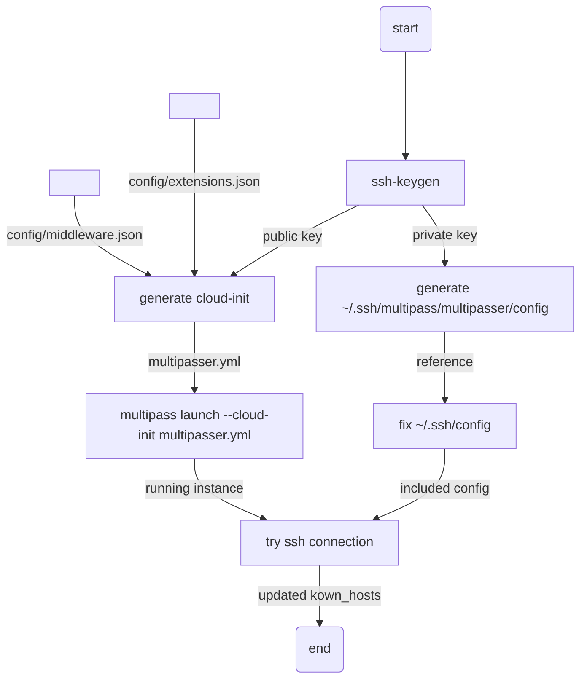

# multipass

## launch

- `launch` スクリプトは、multipass インスタンスの作成および、鍵作成を含めた インスタンスへの ssh 接続設定を実施します。

- 下記に launch スクリプトの処理のフロー図を表します。（コマンドは厳密なものではなくイメージです。）



### 実行コマンド（デフォルト値）

```sh
bash launch
```

### launch オプション設定

- オプションでは multipass インスタンスの CPU・メモリ・ディスクサイズのリソース設定および、初期化時にインストールするパッケージリストや vscode の extension のリストを指定可能です。
- 下記はヘルプオプションの例です。（パスのデフォルト値は実行環境で異なります。）

```sh
bash launch --help
Usage: launch [-h] [-s <ssh config>] [-u <user>] [-p <password>] [-i <instance name>] [-H <hostname>] [-c <cpus>] [-d <disk>] [-m <memory>] [-t <tag>] [-T <timeout>] [-M <middleware-json>] [-e <vscode-extensions-json>] [-n] [-f <log-format>] [-v]

Script description:
  Launch the multipass instance with the current mono repository mounted.

Available options:

-h, --help                    Print this help and exit
-s, --ssh-config              Set ssh config (default: /Users/yutaharigae/.ssh/config)
-u, --user                    Set instance user name (default: multipasser)
-p, --password                Set instance user password (default: multipasser)
-i, --instance                Set instance name (default: multipasser)
-H, --hostname                Set instance hostname (default: multipasser)
-c, --cpus                    Set instance cpus (default: 4)
-d, --disk                    Set instance disk (default: 48G)
-m, --memory                  Set instance memory (default: 8G)
-t, --tag                     Set instance image tag (default: lts)
-T, --timeout                 Set instance launch timeout (default: 3600)
-M, --middleware-json         Set instance middleware.json path (default: /Users/yutaharigae/Desktop/workspace/numagotatu/multipasser/multipass/config/middleware.json)
-e, --vscode-extensions-json  Set instance extensions.json path (default: /Users/yutaharigae/Desktop/workspace/numagotatu/multipasser/multipass/config/extensions.json)
-n, --dry-run                 Run the script in dry-run mode
-f, --format                  Set log format (default: json)
-v, --verbose                 Print debug info
```

## purge

- インスタンスの完全な削除および ssh 接続設定および鍵情報をすべて削除します。
- 削除は、インスタンス -> ssh 接続設定の順で実施します。

```sh
bash purge
```
